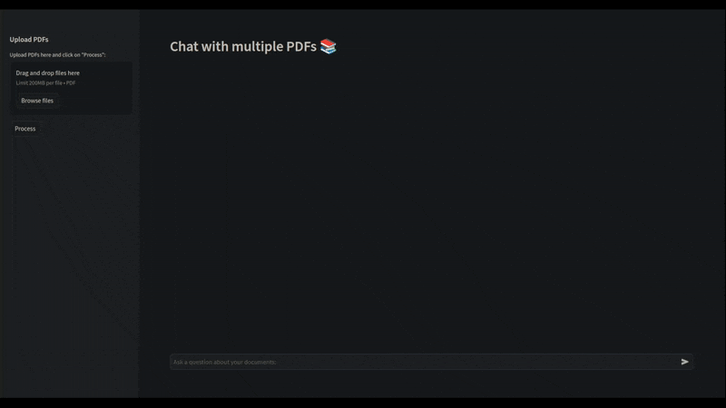

# Chat with multiple PDFs

> A simple chat application with multiple PDFs



## Getting Started

```bash
pip install -r requirements.txt
python -m streamlit run app.py
```

Open <http://localhost:8501> in your browser.
